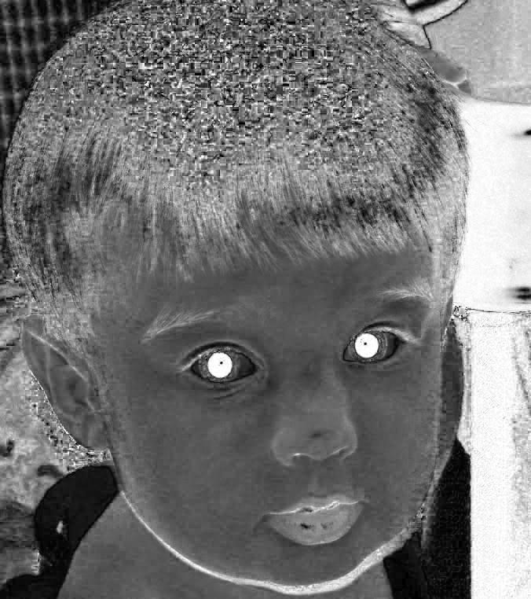
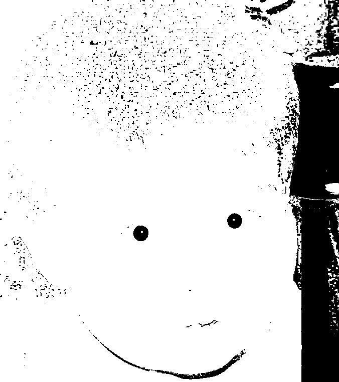

# Correcting red eye in a digital picture, MATLAB
Using Matlab, remove redness from eye while defining the face, while preserving the red color in the rest of the image.

## Images 🖼

## `Before`

## `After`

## `Result 🥇`

